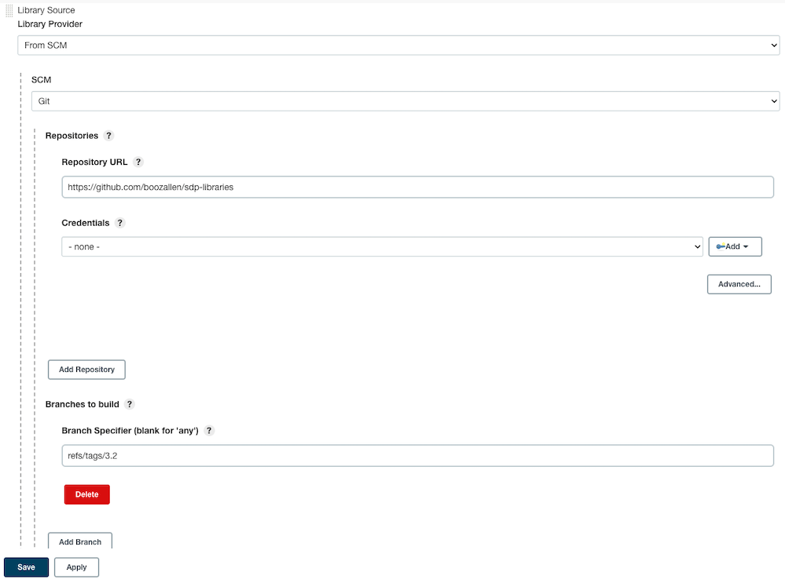

# Pin a Library Source to a Specific Release

Breaking changes will sometimes be merged into the default branch of the SDP Libraries repository. Because of this, you may want to pin the Library Source to a specific release so that your pipelines don't break when the library is updated.

## Steps

1. Navigate to your Jenkins dashboard.
2. Click on "Manage Jenkins" on the left side panel.
3. Click on "Configure System" under the "System Configuration" section.
4. Scroll down to the "Jenkins Templating Engine" section of this page.
5. Find the Library Source you want to pin to a specific release.
6. Update the "Branch Specifier" field using the following format: `refs/tags/{git tag}` (replacing `{git tag}` with the tag you want to pin the Library Source to).
7. Click "Save" to save the changes.

